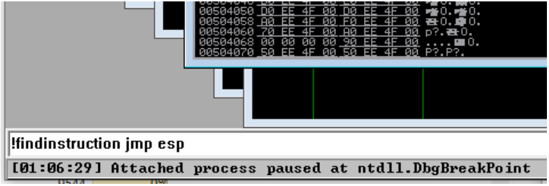
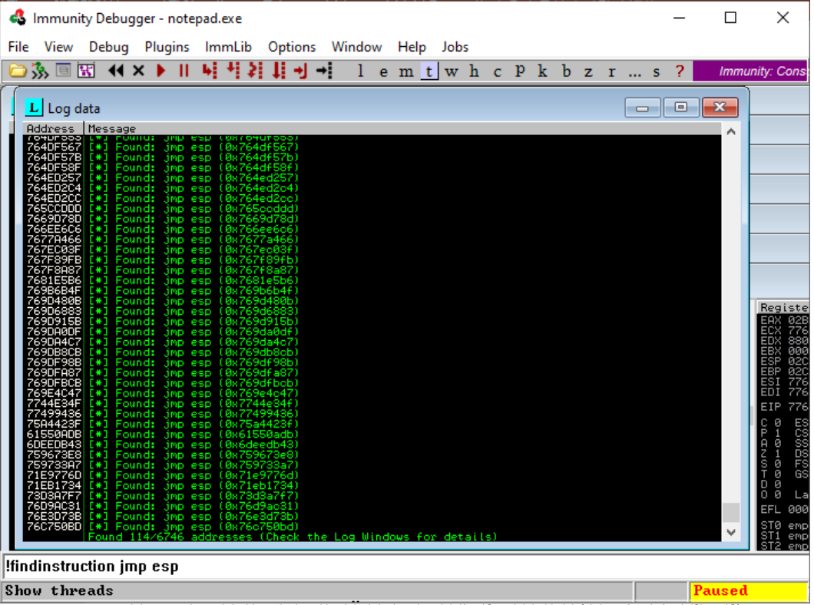
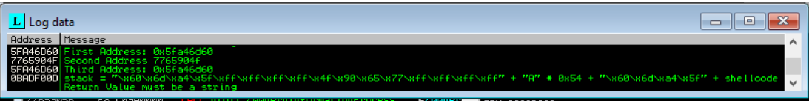

# ImmunityDebugger

### ImmunityDebugger란?

- 공격 코드 개발자나 취약점 발견과 악성 코드를 분석하는 사람들이 이용하는 파이썬 라이브러리, GUI를 제공하는 분석 도구

### 기능

- 동적 분석(runtime) 및 정적 분석 수행 가능
- 함수 및 프로그램 블록의 상호 관계를 GUI로 표현
- 악성 소프트웨어의 디버깅 방지(anti-debugging) 루틴 회피 가능

### 적용 영역

- Software Debugging
- Exploit 개발 도구
- 악성 Software 분석
- 리버스 엔지니어링

### 실습 내용

- Immunity Debugger 활용 파이썬 Exploit 제작
- Immunity Debugger 활용 악성코드 분석 회피 기법 수행

