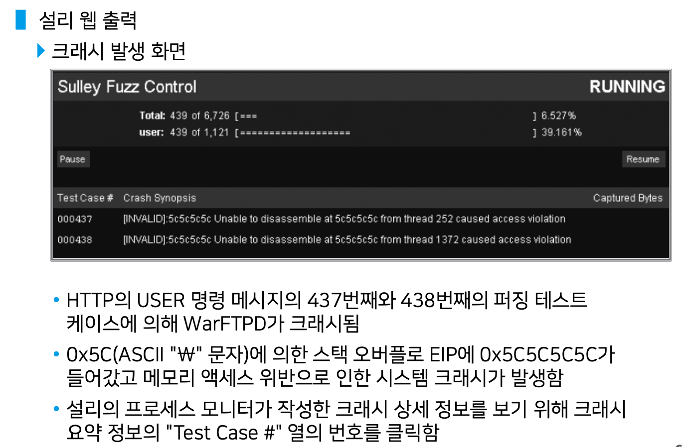
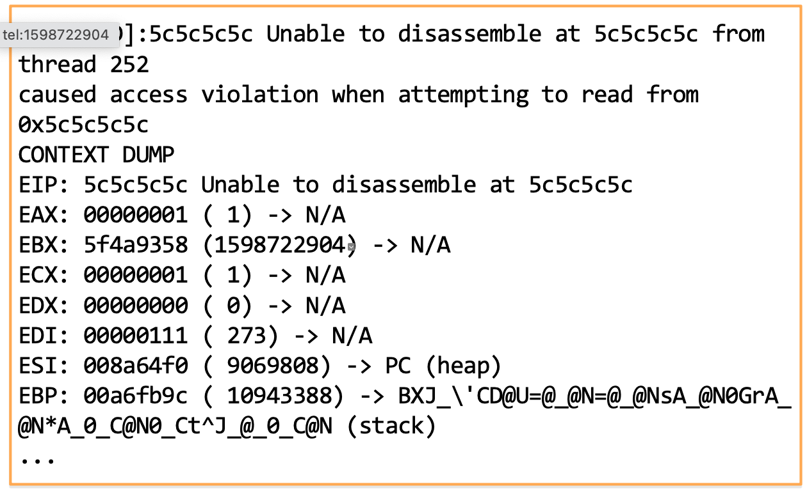

# Sulley

### Sulley이란?

- Fuzzer 개발 혹은 Fuzzing 환경 구성을 도와주는 프레임워크이다.

### 실습 내용

- 설리를 이용한 WarFtpd 퍼징을 실행

### Sulley 기능

- fuzzing에 사용되는 데이터를 구성하는 서비스를 제공
- 타깃에 대한 세션 연결 및 데이터 전송 서비스를 제공
- 타깃 모니터링 및 크래시 데이터 기록 서비스를 제공

### Sulley 특징

- Fuzzing 데이터 구성을 위해 블록 기반(block based) 프로토콜 분석 기법 사용
- 블록의 기본 포맷을 정의하고 블록의 각 구성 요소 필드별로 변형하는 fuzzer 규칙 지정
- example : 네트워크 패킷이나 파일의 정상적 포맷으로부터 각 필드의 길이와 데이터 유형을 변경시킴으로써 Fuzzer 패턴을 생성

